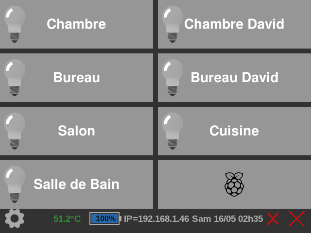
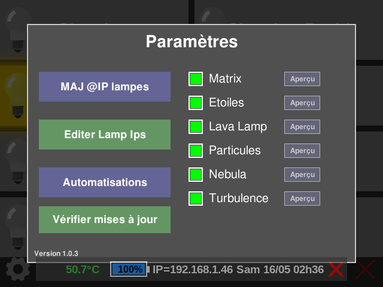
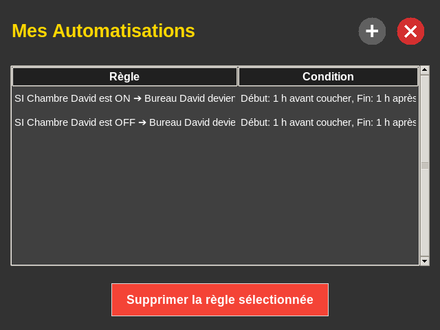
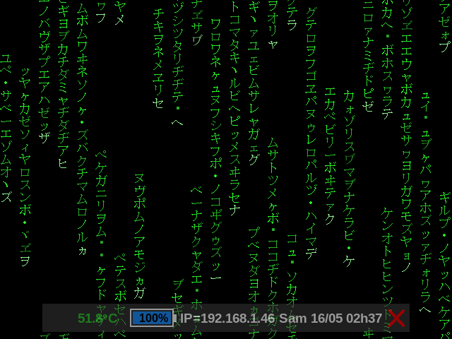
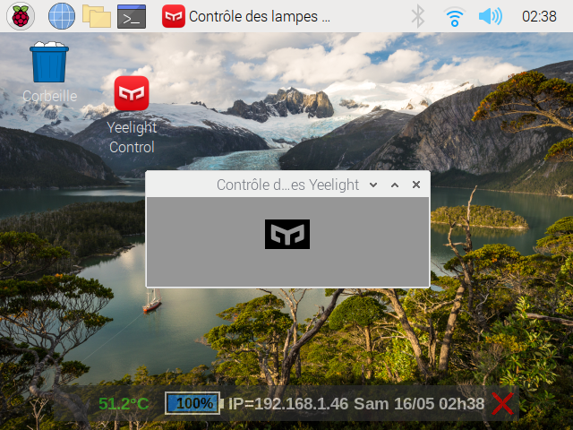

# Yeelight Touchscreen Home Automation Controller


A Raspberry Pi 5 touchscreen home automation controller for local Yeelight smart bulb control over a LAN. The project is written in Python and centers on `yeelight_control.py`, a fullscreen `pygame` interface designed for kiosk-style usage on a 640×480 Raspberry Pi touchscreen.

The controller operates Yeelight bulbs directly on the local network through the Yeelight LAN protocol. No cloud service is required for normal Yeelight operation once the bulbs are reachable on the same LAN and LAN control is enabled in the Yeelight ecosystem.

> **Target environment:** Raspberry Pi 5 + Raspberry Pi OS desktop session + touchscreen display.

> [!NOTE]
> Les chemins runtime sont maintenant majoritairement résolus dynamiquement depuis le dossier du script. Vérifiez surtout la présence des assets locaux (`Config/`, `Videos/`, `sounds/`, `Icons/`) et du venv `YeelightDomEnv/`.

---

## 🎯 Project Goals

This project exists to provide a practical, self-hosted touchscreen controller for Yeelight smart bulbs in a home environment. It is designed for installations where responsiveness, local ownership, and predictable behavior are more important than cloud dashboards or mobile-app-first workflows.

The core philosophy is to keep everyday lighting control close to the user and close to the devices. Commands are sent directly over the local LAN through Yeelight LAN control, which helps deliver fast response times, supports offline-capable operation when internet access is unavailable, and avoids relying on external cloud services for routine bulb actions.

The user experience is intentionally simple: a Raspberry Pi touchscreen presents a kiosk-style interface with large controls, minimal navigation, and immediate feedback. This makes the controller suitable for wall-mounted, desk-mounted, or appliance-like home automation usage where the device should be ready for quick taps rather than keyboard-and-mouse interaction.

Deployment is optimized for a lightweight Raspberry Pi setup. The application uses local scripts, local JSON configuration, and standard Linux desktop tooling so it can run as a dedicated controller without a heavy server stack. The goal is a home-controlled environment that remains understandable, maintainable, and easy to adapt for personal automation needs.

---

## ⚡ Quick Start

A minimal local setup workflow for a Raspberry Pi OS desktop session:

```bash
git clone <your-repository-url> yeelight-control
cd yeelight-control
cd Yeelight_Controller
python3 -m venv YeelightDomEnv
source YeelightDomEnv/bin/activate
pip install -r requirements.txt
export DISPLAY=:0
./start_yeelight_control.sh
```

Before launching on real hardware, make sure the required local JSON files, image assets, sound assets, font file, and video files described below exist at the expected paths or update the scripts for your installation.

---

## ✨ Features

- **Fullscreen touchscreen GUI** built with `pygame`.
- **LAN-only Yeelight control** using the Python `yeelight` library.
- **No cloud dependency** for day-to-day bulb commands.
- **Kiosk-oriented UI** with hidden cursor, fullscreen mode, and a compact windowed mode for editing.
- **Single-tap / double-tap lamp actions**:
  - Single tap toggles a lamp on or off.
  - Double tap toggles a low-brightness warm night mode.
- **Multi-threaded lamp monitoring** to keep UI state synchronized with physical bulb state changes.
- **Automatic Wi-Fi recovery** when all lamps stay unreachable for a configured timeout.
- **Screensaver system** with selectable visual modes:
  - Stars
  - Matrix
  - Lava Lamp video
  - Particles video
  - Nebula video
  - Turbulence video
- **`ffmpeg` video screensaver rendering** into raw RGB frames for the `pygame` surface.
- **Screensaver preview and enable/disable settings** from the touchscreen settings modal.
- **Automation system** with a dedicated touchscreen editor.
- **Astral sun condition support** for sunrise/sunset automation windows.
- **Automation status hint on button**: when a configured automation triggers a target lamp inside an active solar window, the target lamp button shows a translucent `Auto On/Off jusqu'à HHhMM` message for 5 seconds.
- **Lamp IP management** using local JSON files and `arp-scan` discovery.
- **Integrated “Editer Lampes” touchscreen submenu** for lamp reordering and lamp metadata editing.
- **Virtual keyboard support** through `onboard` when editing lamp names in-app.
- **Automatic git update integration** from inside the UI.
- **CPU temperature bubble widget** with Wi-Fi IP display and update/UPS-related UI logic.
- **Startup and shutdown shell scripts** for Raspberry Pi operation.
- **Rotating logs** for the main controller and CPU bubble widget.
- **Local JSON configuration** for lamp IPs, lamp MAC/name configuration, screensaver settings, automations, and related runtime state.
- **Optional SD-card watchdog helper** for Raspberry Pi microSD/MMC kernel error alerts.

---

## 🖼️ Screenshots

### Main Dashboard

<p align="center">
  
</p>

### Settings Modal

<p align="center">
  
</p>

### Automation Editor

<p align="center">
  
</p>

### Matrix Screensaver

<p align="center">
  
</p>

### CPU Bubble Widget

<p align="center">
  
</p>

---

## 🧱 Hardware Requirements

Recommended production setup:

- Raspberry Pi 5.
- Raspberry Pi-compatible touchscreen display.
- microSD card or other boot storage suitable for continuous desktop/kiosk use.
- Wi-Fi or Ethernet LAN access.
- Yeelight smart bulbs connected to the same local network.
- Optional UPS if you want to use the UPS-related behavior implemented in `cpu_temp_bubble.py`.

Yeelight requirements:

- Bulbs must be reachable from the Raspberry Pi on the same LAN.
- LAN control must be enabled for the bulbs in the Yeelight/Mi Home ecosystem.
- Stable IP mapping is recommended. This project can refresh IPs with `arp-scan`, but DHCP reservations are still useful.

---

## 💻 Software Requirements

The project is intended for Raspberry Pi OS with a graphical desktop session.

Core software:

- Raspberry Pi OS with desktop environment.
- Python 3.11 or compatible Python 3 version.
- `git`.
- `ffmpeg` command-line tools.
- `arp-scan` for lamp discovery.
- `pygame` and other Python dependencies from `requirements.txt`.
- `onboard` virtual keyboard for touchscreen editing.
- `picom` for transparent overlay behavior used by the CPU bubble helper stack.

Optional helper dependencies:

- `zenity` and `notify-send` for the SD watchdog alert script.
- `PyQt5` if you use `bubble_helper.py` directly. It imports `PyQt5`, but `PyQt5` is not currently listed in `requirements.txt`.

---

## 🍓 Raspberry Pi OS Setup

Update the base OS and install system packages:

```bash
sudo apt update
sudo apt upgrade -y

sudo apt install -y \
  git \
  python3 \
  python3-venv \
  python3-pip \
  ffmpeg \
  arp-scan \
  onboard \
  picom \
  zenity \
  libnotify-bin
```

Clone the repository from your home directory. The launcher and runtime scripts now resolve paths primarily from their own location in `Yeelight_Controller/`, which simplifies deployment on another username or base path.

```bash
cd ~
git clone <your-repository-url> yeelight-control
cd yeelight-control
cd Yeelight_Controller
```

For the existing production-style path layout, scripts may also be placed directly in `~/Yeelight_Controller`. The startup script detects whether the application is in `~/Yeelight_Controller` and falls back to the directory containing the script when needed.

---

## 🐍 Python Virtual Environment Setup

The application currently expects the production virtual environment at:

```text
~/yeelight-control/Yeelight_Controller/YeelightDomEnv
```

Create it with:

```bash
python3 -m venv ~/yeelight-control/Yeelight_Controller/YeelightDomEnv
source ~/yeelight-control/Yeelight_Controller/YeelightDomEnv/bin/activate
python -m pip install --upgrade pip setuptools wheel
```

If you choose another virtual environment path, update:

- `venv_path` in `yeelight_control.py`.
- `PYTHON_BIN` in `start_yeelight_control.sh`.

---

## 📦 Install Python Requirements

Install the Python dependencies from the repository:

```bash
source ~/yeelight-control/Yeelight_Controller/YeelightDomEnv/bin/activate
cd ~/yeelight-control/Yeelight_Controller
pip install -r requirements.txt
```

The dependency set includes `pygame`, `numpy`, `ffmpeg-python`, `yeelight`, `astral`, `opencv-python`, `psutil`, `pillow`, and related packages.

---

## 🎞️ Install and Verify ffmpeg

Install `ffmpeg` with APT:

```bash
sudo apt install -y ffmpeg
```

Verify it is available:

```bash
ffmpeg -version
```

The video screensavers use `ffmpeg-python` to start an `ffmpeg` process that reads a random segment of a configured video and streams raw `rgb24` frames into the `pygame` display surface.

Configured production video paths:

```text
~/Yeelight_Controller/Videos/lava_lamp.mp4
~/Yeelight_Controller/Videos/particles_explosions.mp4
~/Yeelight_Controller/Videos/Nebula.mp4
~/Yeelight_Controller/Videos/Turbulence.mp4
```

Create the directory and copy your videos:

> [!IMPORTANT]
> Les vidéos réelles (fichiers volumineux) doivent être copiées localement dans `Yeelight_Controller/Videos/`. Ce dossier est ignoré par Git et n'est pas versionné.

```bash
mkdir -p ~/Yeelight_Controller/Videos
# Copy the required video files into ~/Yeelight_Controller/Videos
```

---

## ⚙️ Required Local Files and Assets

Several local files and assets are referenced by absolute production paths. Ensure they exist or update the scripts for your environment.

### JSON configuration files

> [!IMPORTANT]
> Les fichiers JSON de configuration locale doivent être présents dans `Yeelight_Controller/Config/` avant le premier lancement.

```text
~/Yeelight_Controller/Config/lamp_ips.json
~/Yeelight_Controller/Config/lamp_config.json
~/Yeelight_Controller/Config/screensavers_set.json
~/Yeelight_Controller/Config/automations.json
~/Yeelight_Controller/Config/ups_shutdown_config.json
```

### Image assets

```text
~/Yeelight_Controller/Icons/yeelight_logo_32x32.png
~/Yeelight_Controller/Icons/bulb_on.png
~/Yeelight_Controller/Icons/bulb_off.png
~/Yeelight_Controller/Icons/arrow_back_icon.png
~/Yeelight_Controller/Icons/raspberry-pi_logo_button.png
~/Yeelight_Controller/Icons/yeelight_logo_button.png
~/Yeelight_Controller/Icons/settings_icon.png
~/Yeelight_Controller/Icons/update_logo.png
```

### Sound assets

```text
~/Yeelight_Controller/sounds/click.wav
~/Yeelight_Controller/sounds/light_on.wav
~/Yeelight_Controller/sounds/light_off.wav
```

### Font asset

```text
~/Yeelight_Controller/font/ms mincho.ttf
```

The Matrix screensaver uses this font to render Katakana-style symbols.

---

## 🚀 Launch Manually

From a Raspberry Pi desktop session:

```bash
cd ~/yeelight-control/Yeelight_Controller
./start_yeelight_control.sh
```

Ou en lancement direct Python :

```bash
cd ~/yeelight-control/Yeelight_Controller
YeelightDomEnv/bin/python3 -u yeelight_control.py
```

To start the CPU temperature bubble separately:

```bash
export DISPLAY=:0
source ~/yeelight-control/Yeelight_Controller/YeelightDomEnv/bin/activate
cd ~/yeelight-control/Yeelight_Controller
python3 cpu_temp_bubble.py
```

The launcher waits for the LXDE session, starts `yeelight_control.py`, then starts `cpu_temp_bubble.py` if they are not already running.

---

## 🔁 Launch Automatically at Startup

The Git repository root is `yeelight-control/`, and the runnable application folder is `Yeelight_Controller/`.

The repository includes `start_yeelight_control.sh`, which is intended to be called after the Raspberry Pi desktop session has started.

One common Raspberry Pi OS desktop approach is LXDE autostart:

```bash
mkdir -p ~/.config/lxsession/LXDE-pi
sudo nano /etc/xdg/lxsession/LXDE-pi/autostart
```

Add:

```text
@/home/arut16/Yeelight_Controller/start_yeelight_control.sh
```

Make the script executable:

```bash
chmod +x /home/arut16/Yeelight_Controller/start_yeelight_control.sh
```

Reboot to test:

```bash
sudo reboot
```


### Raccourci bureau `.desktop`

Utilisez les chemins suivants dans votre fichier `.desktop` :

```ini
Exec=/bin/bash /home/arut16/Yeelight_Controller/start_yeelight_control.sh
Icon=/home/arut16/Yeelight_Controller/Icons/yeelight_logo.png
```

### `sd-watchdog.service`

Pour un service systemd dédié au watchdog SD :

```ini
ExecStart=/home/arut16/Yeelight_Controller/YeelightDomEnv/bin/python3 -u /home/arut16/Yeelight_Controller/sd_watchdog.py
```

Startup logs are written to:

```text
~/Yeelight_Controller/start_yeelight_control_debug.log
```

> If your project is installed somewhere else, adjust the path in the autostart entry. The script itself falls back to its own directory if it does not find the application scripts directly in `~/Yeelight_Controller`.

---

## ⏻ Shutdown Script

`shutdown_script.sh` stops the CPU bubble and main controller processes, waits briefly, and powers off the Raspberry Pi:

```bash
chmod +x shutdown_script.sh
./shutdown_script.sh
```

Because it calls system shutdown through `sudo`, configure sudo permissions appropriately for your kiosk user if you want passwordless shutdown.

---

## 🔄 Git Update Workflow

The main application includes an automatic git update workflow in the settings modal.

How it works:

1. The app reads the local project version from `Yeelight_Controller/VERSION`.
2. The settings modal shows the current version.
3. The **Vérifier mises à jour** button runs git commands in the project directory.
4. The app fetches the upstream branch and lists files changed between `HEAD` and the upstream ref.
5. If updates are available, the update modal can apply them with `git pull --ff-only`.
6. After a successful pull, the application restarts the controller process and restarts the CPU bubble process.

Manual equivalent:

```bash
cd ~/yeelight-control/Yeelight_Controller
git fetch --prune
git status
git pull --ff-only
```

Important notes:

- The in-app workflow expects the repository to have a configured remote/upstream branch.
- The pull is fast-forward only.
- Keep local production changes committed or stashed before using the in-app update button.

---

## 🌌 Screensaver System

The controller enters a screensaver after inactivity while running in fullscreen mode. The default inactivity timeout is five minutes.

Available modes:

| Mode | Type | Description |
| --- | --- | --- |
| Stars | Procedural `pygame` | Colored stars move outward from the screen center. |
| Matrix | Procedural `pygame` | Katakana-like falling symbol columns. |
| Lava Lamp | Video | Random segment from `lava_lamp.mp4`. |
| Particles | Video | Random segment from `particles_explosions.mp4`. |
| Nebula | Video | Random segment from `Nebula.mp4`. |
| Turbulence | Video | Random segment from `Turbulence.mp4`. |

Screensaver settings are stored in:

```text
~/Yeelight_Controller/screensavers_set.json
```

The settings modal lets you:

- Enable or disable each screensaver.
- Preview each screensaver.
- Exit a screensaver with a touch or key press.

Video screensavers use `ffmpeg` with raw frame output:

```text
ffmpeg input video -> raw rgb24 pipe -> numpy frame -> pygame surface
```

---

## 🤖 Automation System

Automation rules are edited with `automatisations.py`, a dedicated fullscreen `tkinter` interface optimized for the same 640×480 touchscreen.

Rules are stored in:

```text
~/Yeelight_Controller/automations.json
```

A rule contains:

- Trigger lamp name.
- Trigger state: `on` or `off`.
- Target lamp name.
- Target action: `on` or `off`.
- Optional solar condition.

Example automation shape:

```json
[
  {
    "trigger": "Living Room",
    "trigger_state": "on",
    "target": "Desk",
    "action": "on",
    "condition": {
      "start": "sunset_offset_-30",
      "end": "sunrise_offset_30",
      "text": "Début: 30 min avant coucher, Fin: 30 min après lever"
    }
  }
]
```

The main controller reloads rules after the automation editor closes. It also monitors lamp state changes in the background, so automation can react both to touchscreen actions and to detected state changes.

### Astral sun conditions

When `astral` is installed, solar conditions are evaluated against the configured location in `yeelight_control.py`:

```text
Latitude: 43.659
Longitude: 7.123
Location label: Villeneuve-Loubet, France
Timezone: Europe/Paris
```

If a condition combines one pre-event bound and one post-event bound across sunrise and sunset, it is evaluated as two short windows around those solar events instead of one continuous overnight interval. For example, `sunset_offset_-60` to `sunrise_offset_60` is active from one hour before to one hour after sunset, and from one hour before to one hour after sunrise.

If `astral` is unavailable or condition evaluation fails, the code treats the condition as active to keep automations from blocking unexpectedly.

---

## 🧩 Configuration Files

The current configuration model is file-based and uses paths under `~/Yeelight_Controller/`. Future versions may centralize paths and runtime settings into a dedicated configuration system or `.env`-style configuration to improve portability.

### `lamp_config.json`

Production path:

```text
~/Yeelight_Controller/lamp_config.json
```

Used by `update_lamp_ips.py` to map lamp names and MAC addresses. The script supports either common orientation and normalizes the mapping internally.

Example:

```json
{
  "Living Room": "AA:BB:CC:DD:EE:FF",
  "Desk": "11:22:33:44:55:66"
}
```

### `lamp_ips.json`

Production path:

```text
~/Yeelight_Controller/lamp_ips.json
```

Used by the main UI to build lamp buttons and connect to bulbs.

Example:

```json
{
  "Living Room": "192.168.1.40",
  "Desk": "192.168.1.41"
}
```

### `screensavers_set.json`

Production path:

```text
~/Yeelight_Controller/screensavers_set.json
```

Stores enabled/disabled flags for screensaver modes.

Example:

```json
{
  "matrix": true,
  "stars": true,
  "lava": true,
  "particles": true,
  "nebula": true,
  "turbulence": true
}
```

### `automations.json`

Production path:

```text
~/Yeelight_Controller/automations.json
```

Stores automation rules created by the automation editor.

### `VERSION`

Repository path:

```text
Yeelight_Controller/VERSION
```

Displayed in the settings modal and used by the git update workflow when comparing with the upstream version file.

---

## 🪵 Logging System

The project uses local log files suitable for unattended Raspberry Pi operation.

| Component | Log file | Notes |
| --- | --- | --- |
| Main controller | `~/Yeelight_Controller/yeelight_control.log` | Uses `RotatingFileHandler`, 10 MB max, one backup. |
| Startup launcher | `~/Yeelight_Controller/start_yeelight_control_debug.log` | Recreated each launcher run. |
| CPU bubble | `~/Yeelight_Controller/cpu_temp_bubble.log` | Uses rotating logging in `cpu_temp_bubble.py`. |
| Lamp IP updater | `lamp_ips_update.log` | Relative to the working directory used when running `update_lamp_ips.py`. |
| SD watchdog | stdout/system service logs | Intended for service-style execution or terminal monitoring. |

Useful commands:

```bash
tail -f ~/Yeelight_Controller/yeelight_control.log
tail -f ~/Yeelight_Controller/start_yeelight_control_debug.log
tail -f ~/Yeelight_Controller/cpu_temp_bubble.log
```

---

## 🏗️ Architecture Overview

```text
                 ┌───────────────────────────┐
                 │ Raspberry Pi touchscreen  │
                 └─────────────┬─────────────┘
                               │
                               ▼
┌────────────────────────────────────────────────────────┐
│ yeelight_control.py                                    │
│ - pygame fullscreen kiosk UI                           │
│ - lamp button rendering                                │
│ - Yeelight LAN commands                                │
│ - screensaver manager                                  │
│ - git update modal                                     │
│ - background lamp monitor thread                       │
└───────────────┬───────────────────┬────────────────────┘
                │                   │
                │                   ▼
                │        ┌───────────────────────┐
                │        │ automatisations.py │
                │        │ tkinter editor         │
                │        │ automations.json       │
                │        └───────────────────────┘
                │
                ▼
┌─────────────────────────┐       ┌──────────────────────┐
│ Yeelight bulbs on LAN   │       │ Local JSON config     │
│ No cloud required       │       │ lamp_ips/config/etc.  │
└─────────────────────────┘       └──────────────────────┘
                ▲
                │
┌───────────────┴───────────────┐
│ update_lamp_ips.py            │
│ arp-scan local network scan   │
└───────────────────────────────┘

┌───────────────────────────┐
│ cpu_temp_bubble.py        │
│ Tk overlay widget          │
│ CPU temp / Wi-Fi IP / UPS  │
└───────────────────────────┘
```

The architecture favors a direct Raspberry Pi deployment layout with local scripts and local JSON files under `Yeelight_Controller/`.

---

## 🌳 Project Structure

```text
.
├── README.md
├── Yeelight_Controller/
    ├── VERSION
    ├── automatisations.py          # Touchscreen automation editor
    ├── bubble_helper.py            # PyQt5 speech-bubble overlay helper
    ├── cpu_temp_bubble.py          # CPU temperature / IP / update / UPS bubble widget
    ├── requirements.txt            # Python dependency pins
    ├── sd_watchdog.py              # microSD/MMC kernel error alert helper
    ├── shutdown_script.sh          # Stops app processes and powers off the Pi
    ├── start_yeelight_control.sh   # Desktop-session startup launcher
    ├── update_lamp_ips.py          # arp-scan-based Yeelight IP updater
    ├── yeelight_control.py         # Main pygame Yeelight touchscreen controller
    ├── Config/                     # JSON de configuration locale
    ├── Icons/                      # Icônes UI
    ├── sounds/                     # Sons UI
    ├── Logs/                       # Logs runtime
    └── Videos/                     # Vidéos locales non versionnées (à copier localement)
```

---

## 🛠️ Troubleshooting

### The GUI does not appear

Check that a desktop session is running and `DISPLAY` is set:

```bash
export DISPLAY=:0
pgrep -f lxsession
```

Review launcher logs:

```bash
tail -n 100 ~/Yeelight_Controller/start_yeelight_control_debug.log
```

### `pygame.error: No available video device`

Run the application inside the Raspberry Pi graphical session, not from a headless SSH shell without X forwarding/session access. If launching from SSH into the local desktop, ensure:

```bash
export DISPLAY=:0
```

### Lamps do not respond

Verify the bulbs are reachable:

```bash
ping <lamp-ip>
```

Confirm `lamp_ips.json` contains the current IP addresses:

```bash
cat ~/Yeelight_Controller/lamp_ips.json
```

Refresh lamp IPs:

```bash
cd ~/yeelight-control/Yeelight_Controller
source ~/yeelight-control/Yeelight_Controller/YeelightDomEnv/bin/activate
python3 update_lamp_ips.py
```

Also confirm Yeelight LAN control is enabled for each bulb.

### `arp-scan` fails or returns no lamps

Install `arp-scan`:

```bash
sudo apt install -y arp-scan
```

Run manually:

```bash
sudo arp-scan --localnet
```

If this requires a password during kiosk use, configure appropriate sudo rules for the Raspberry Pi user.

### Video screensavers are black or fail

Verify videos exist at the configured paths:

```bash
ls -lh ~/Yeelight_Controller/Videos
```

Verify `ffmpeg` works:

```bash
ffmpeg -version
```

If hardware acceleration causes issues on your OS image, inspect the `ffmpeg.input(..., hwaccel='drm')` usage in `yeelight_control.py` and adjust for your Raspberry Pi OS graphics stack.

### Matrix screensaver font error

Ensure this file exists:

```bash
ls -lh "~/Yeelight_Controller/font/ms mincho.ttf"
```

Or update the font path in `yeelight_control.py`.

### Sound files fail to load

Ensure the referenced sound assets exist:

```bash
ls -lh ~/Yeelight_Controller/sounds
```

Required files:

```text
click.wav
light_on.wav
light_off.wav
```

### Virtual keyboard does not open

Install `onboard`:

```bash
sudo apt install -y onboard
```

The app launches `onboard` while editing lamp names from the `Editer Lampes` touchscreen submenu.

### In-app git update fails

Check repository status and upstream configuration:

```bash
cd ~/yeelight-control/Yeelight_Controller
git status
git remote -v
git branch -vv
```

The in-app updater uses `git fetch --prune` and `git pull --ff-only`, so local uncommitted changes or non-fast-forward history can block updates.

### All lamps show unavailable and Wi-Fi recovery runs

The monitor thread considers all lamps offline after repeated failures. If all lamps stay unreachable for the configured timeout, it attempts:

```bash
sudo ifdown wlan0
sudo ifup wlan0
```

Make sure those commands are valid for your Raspberry Pi OS networking setup. Newer NetworkManager-based installations may require adapting this recovery logic.

---

## ⚠️ Known Limitations

- Le dépôt Git est à la racine, avec `Yeelight_Controller/` comme sous-dossier applicatif; vérifiez vos chemins d'installation si vous déployez ailleurs.
- The UI is optimized mainly for 640×480 Raspberry Pi touchscreen usage.
- There is no authentication layer; the controller is intended for trusted local touchscreen access.
- The application is designed for LAN environments only and expects Yeelight bulbs to be reachable locally.
- Portability is limited without path adjustments and Raspberry Pi OS desktop-session assumptions.
- The application depends on local image, sound, font, video, and JSON configuration assets existing at expected locations.

---

## 🧭 Future Improvements

Potential improvements that fit the current architecture:

- Replace hardcoded `~/Yeelight_Controller` paths with a single configuration file or environment variables.
- Add a first-run setup wizard for lamp config, assets, and paths.
- Add systemd user/service templates for startup instead of relying only on desktop autostart.
- Add screenshots and a short demo video to the repository.
- Add a sample `lamp_config.json`, `lamp_ips.json`, `screensavers_set.json`, and `automations.json` under an `examples/` directory.
- Add automated linting and formatting configuration.
- Add graceful handling for missing image, sound, font, and video assets.
- Add configurable location settings for Astral sun conditions.
- Add a settings screen for video paths and screensaver timeout.
- Add tests for JSON parsing, automation rule evaluation, and sun-condition windows.


---

## 🗂️ Changelog complet du projet

Historique chronologique de **tous les commits** depuis l’initialisation du dépôt :

- 2026-05-16 — `4ad0c03` — Yeelight Control Project
- 2026-05-16 — `43312f9` — Add project update checker
- 2026-05-16 — `0d20a0f` — Merge pull request #1 from arut16/codex/add-update-check-button-in-settings
- 2026-05-16 — `058923e` — Bump version to 1.0.1
- 2026-05-16 — `5b5be01` — Merge pull request #2 from arut16/codex/colorier-bouton-verifier-mises-a-jour
- 2026-05-16 — `1605c42` — Keep settings open when no updates are found
- 2026-05-16 — `f45997b` — Merge pull request #3 from arut16/codex/prevent-auto-close-of-settings-window
- 2026-05-16 — `de5b1f1` — Bump version to 1.0.3
- 2026-05-16 — `e56cf85` — Merge pull request #4 from arut16/codex/augmenter-taille-message-mise-a-jour
- 2026-05-16 — `0b50833` — Add requirements
- 2026-05-16 — `5b349b6` — Add professional project README
- 2026-05-16 — `728e47b` — Merge pull request #5 from arut16/codex/create-comprehensive-readme.md-for-project
- 2026-05-16 — `43bd086` — Enhance README quick start and limitations
- 2026-05-16 — `62169ed` — Merge branch 'main' into codex/create-comprehensive-readme.md-for-project-h7w4tz
- 2026-05-16 — `ee302fb` — Merge pull request #6 from arut16/codex/create-comprehensive-readme.md-for-project-h7w4tz
- 2026-05-16 — `a6dc2dd` — Add README screenshots
- 2026-05-16 — `5a91cdb` — Update README screenshots section
- 2026-05-16 — `94d4691` — Merge pull request #7 from arut16/codex/update-readme.md-with-real-screenshots
- 2026-05-16 — `490d57d` — Add project goals and MIT license
- 2026-05-16 — `8f18b78` — Merge pull request #8 from arut16/codex/update-readme-and-add-mit-license
- 2026-05-16 — `01e8738` — Fix scheduled shutdown startup grace
- 2026-05-16 — `859ebb7` — Merge pull request #9 from arut16/codex/fix-rpi-reboot-issue-and-update-version
- 2026-05-17 — `4cc49e3` — Fix solar automation windows
- 2026-05-17 — `316ecdc` — Merge pull request #10 from arut16/codex/corriger-le-bug-de-l-automatisation-du-coucher-du-soleil
- 2026-05-17 — `7552e4c` — Update release badge from 1.0.4 to 1.0.5
- 2026-05-17 — `e36a1cb` — Update release badge to version 1.0.5
- 2026-05-18 — `40bca3d` — Generalise le hint auto a toute lampe cible
- 2026-05-18 — `333b6c9` — Merge pull request #11 from arut16/codex/add-auto-on/off-notifications-for-bureau-david
- 2026-05-21 — `3170c98` — Add file 'à supprimer' with placeholder content
- 2026-05-21 — `d0c9ef7` — Add files via upload
- 2026-05-21 — `6e2be4f` — Delete sounds/à supprimer
- 2026-05-21 — `f2d115a` — Create à supprimer
- 2026-05-21 — `61ad0b0` — Add files via upload
- 2026-05-21 — `a1e5fc7` — Delete Pictures/à supprimer
- 2026-05-21 — `a92fc14` — Create à supprimer
- 2026-05-21 — `a4370a4` — Add placeholder video file 'lava_lamp.mp4'
- 2026-05-21 — `5bd886c` — Create Nebula.mp4
- 2026-05-21 — `93830f8` — Create particules_explosions.mp4
- 2026-05-21 — `bd2cb99` — Create Turbulence.mp4
- 2026-05-21 — `9b89322` — Delete Videos/à supprimer
- 2026-05-22 — `3250917` — Fix LXDE autostart docs and support venv inside project folder
- 2026-05-22 — `93e8e02` — Merge pull request #12 from arut16/codex/refactor-path-management-and-reorganize-files
- 2026-05-22 — `23e3a26` — Create to delete
- 2026-05-22 — `b0780d7` — Add files via upload
- 2026-05-22 — `6f469c3` — Create to delete
- 2026-05-22 — `4902621` — Add files via upload
- 2026-05-22 — `b1c9402` — Add files via upload
- 2026-05-22 — `2343c29` — Delete Yeelight Controller/Config/to delete
- 2026-05-22 — `5d045ab` — Delete Yeelight Controller/font/to delete
- 2026-05-22 — `4b876c2` — Rename MS Mincho.ttf to ms mincho.ttf
- 2026-05-22 — `7c6c388` — Rename project directory to Yeelight_Controller
- 2026-05-22 — `39766b1` — Merge pull request #13 from arut16/codex/rename-project-folder-to-yeelight_controller
- 2026-05-22 — `9165f96` — Delete Yeelight Controller/font directory
- 2026-05-22 — `cab596f` — Fix git updater repo cwd and remote VERSION path
- 2026-05-22 — `d483852` — Merge pull request #14 from arut16/codex/fix-git-update-function-logic
- 2026-05-22 — `6a9771a` — Move canonical README back to repository root
- 2026-05-22 — `2b23000` — Merge pull request #15 from arut16/codex/fix-readme-display-on-github
- 2026-05-24 — `1bdf521` — Bump version to 1.1.1 and update README for Editer Lampes
- 2026-05-24 — `a6e7554` — Merge pull request #16 from arut16/codex/refactor-edit-lamps-feature-with-new-menu
- 2026-05-24 — `a23d18b` — Fix startup crash when pygame audio init fails
- 2026-05-24 — `0a0a08a` — Merge pull request #17 from arut16/codex/fix-pygame-window-crash-on-launch
- 2026-05-24 — `669d04c` — Fix undefined mouse position in MOUSEMOTION handler
- 2026-05-24 — `ef320f7` — Merge pull request #18 from arut16/codex/fix-nameerror-for-pos-variable
- 2026-05-24 — `a8cb0da` — Fix unstable click handling after pos NameError patch
- 2026-05-24 — `3eceb0a` — Merge pull request #19 from arut16/codex/fix-button-click-instability-after-change
- 2026-05-24 — `06324d7` — Fix touch focus handling across active modal screens
- 2026-05-24 — `4391e19` — Merge pull request #20 from arut16/codex/corriger-gestion-de-l-appui-sur-l-ecran
- 2026-05-24 — `807afde` — Aligner l'éditeur de lampes sur la grille 4x2 et sauvegarder au déplacement
- 2026-05-24 — `e7ab8eb` — Merge pull request #21 from arut16/codex/reorganize-buttons-in-edit-lamps-menu
- 2026-05-24 — `f5359a0` — Fix lamp order sync and enlarge edit drag handles
- 2026-05-24 — `7818ef6` — Merge pull request #22 from arut16/codex/fix-button-layout-and-drag-area
- 2026-05-24 — `7d4b540` — Améliore le drag dans l'éditeur de lampes
- 2026-05-24 — `07b67af` — Merge pull request #23 from arut16/codex/center-lamp-names-in-edit-lamps-menu
- 2026-05-24 — `a80d4cd` — Améliore l'édition des lampes et la liste défilante
- 2026-05-24 — `ccfc008` — Merge pull request #24 from arut16/codex/fix-lamp-name-editing-and-list-display
- 2026-05-24 — `8bc239c` — Revert "Améliore l'édition des lampes et la liste défilante dans «Editer Lampes»"
- 2026-05-24 — `634fa88` — Merge pull request #25 from arut16/revert-24-codex/fix-lamp-name-editing-and-list-display
- 2026-05-24 — `3b7cd88` — Améliore l'édition du nom et la liste MAC dans Editer Lampes
- 2026-05-24 — `9a16abe` — Merge pull request #26 from arut16/codex/fix-keyboard-visibility-for-lamp-name-edit
- 2026-05-24 — `2a5dca0` — Fix lamp editor keyboard focus and MAC list ordering/scrollbar
- 2026-05-24 — `8eea8a3` — Merge pull request #27 from arut16/codex/fix-keyboard-display-issue-in-edit-lamps
- 2026-05-24 — `63a3fcc` — Ajoute un clavier virtuel intégré pour l'édition des lampes
- 2026-05-24 — `ceba693` — Merge pull request #28 from arut16/codex/fix-keyboard-display-in-edit-lamps-menu
- 2026-05-24 — `39c4082` — Améliore le clavier d'édition et le chargement MAC
- 2026-05-24 — `302d90c` — Merge pull request #29 from arut16/codex/ajouter-gestion-lettres-majuscules-clavier
- 2026-05-24 — `b85f0ec` — Fix lamp rename keeping IP mapping in editor
- 2026-05-24 — `ae6ce53` — Merge pull request #30 from arut16/codex/corriger-bug-de-disponibilite-des-lampes

---

## 📄 License

This project is licensed under the MIT License. See [`LICENSE`](LICENSE) for the full license text.

---

## 🙏 Credits

Built for a Raspberry Pi 5 touchscreen home automation setup using:

- Python
- `pygame`
- `yeelight`
- `ffmpeg-python` and `ffmpeg`
- `astral`
- `tkinter`
- Raspberry Pi OS
- Yeelight smart bulbs with LAN control enabled
